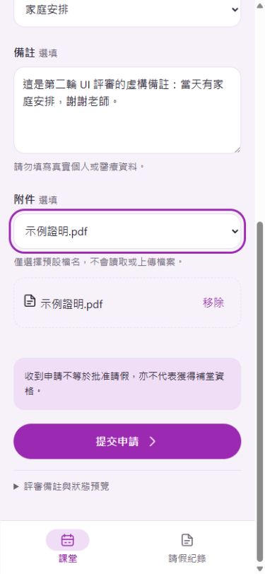
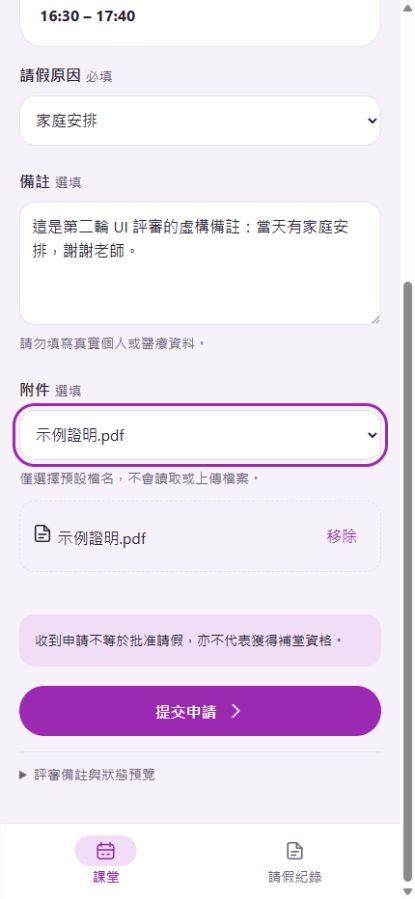
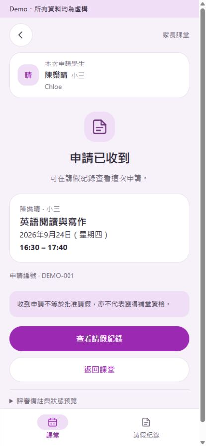
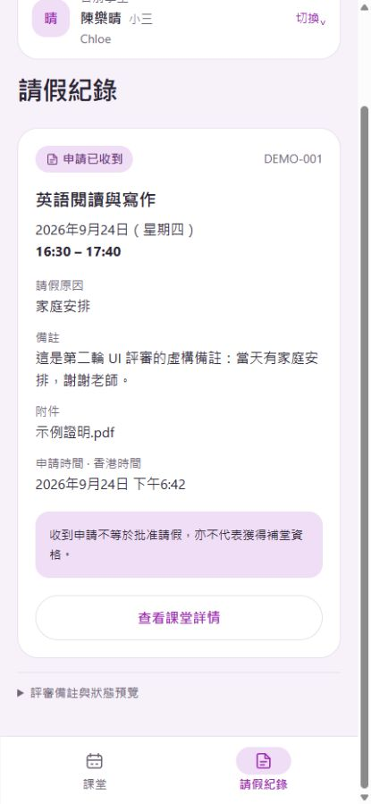

# 第二輪 UI 評審截圖 · Demo 0.2

2026-09-24。以下為實際瀏覽器viewport截圖。表單／紀錄均在評審備註收合時捲到最底部；桌面結果不能代替真實手機軟鍵盤或安全區測試。

標題為實測viewport尺寸。截圖工具回傳的JPEG影像分別為375×812及415×899像素，保留原始回傳大小，未重繪或放大；DOM viewport量測仍為390×844及430×932。

## 390 × 844

### 課堂列表首屏

### 請假表單捲到最底部

### 提交成功：申請已收到

### 請假紀錄捲到最底部

## 430 × 932

### 課堂列表首屏

### 請假表單捲到最底部

### 提交成功：申請已收到

### 請假紀錄捲到最底部

## 補充：200%文字及長短頁面

- [390x844 放大表單](390x844-form-200.jpg)
- [390x844 放大紀錄](390x844-records-200.jpg)
- [390x844 放大長備註](390x844-long-records-200.jpg)
- [390x844 預設短頁面](390x844-empty-100.jpg)
- [390x844 放大空紀錄](390x844-empty-200.jpg)
- [430x932 放大表單](430x932-form-200.jpg)
- [430x932 放大紀錄](430x932-records-200.jpg)
- [430x932 放大長備註](430x932-long-records-200.jpg)
- [430x932 預設短頁面](430x932-empty-100.jpg)
- [430x932 放大空紀錄](430x932-empty-200.jpg)

[14組位置量測](measurements.json) · [實際CSS字級](typography.json)
